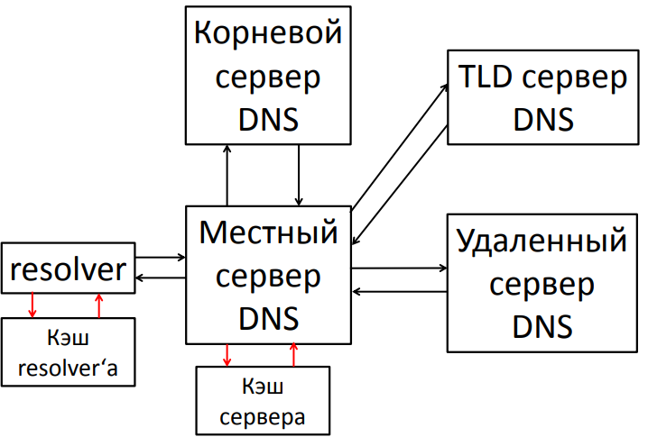

[ study](../../) > [inet](../) > dns

# DNS

_Pault Mockapetris_ - автор DNS.

__DNS__ - это иерархическая база данных, сопоставляющая имена сетевых узлов и их сетевых служб IP-адресам узлов. Содержимое этой базы, с одной стороны, распределено по большому количеству серверов службы DNS, а с другой стороны, является централизованно управляемым. 

В основе иерархической структуры базы данных DNS лежит доменное пространство имен (domain namespace), основной структурной единицей которого является домен, объединяющий сетевые узлы (хосты), а также поддомены. Процесс поиска в БД службы DNS имени некоего сетевого узла и сопоставления этому имени IP-адреса называется "разрешением имени узла в пространстве имен DNS".

[TOC]

## История

Систему доменных имен разработал в 1983 году __Пол Мокапетрис__. Тогда же было проведено первое успешное тестирование DNS, ставшей позже одним из базовых компонентов сети Internet. С помощью DNS стало возможным реализовать масштабируемый распределенный механизм, устанавливающий соответствие между иерархическими именами сайтов и числовыми IP-адресами. 

* Файл host и плоские имена поддерживаются и по сей день таблицами соответствия IP-адреса и имени хоста (текстовые файлы с именем hosts).
  * 127.0.0.1 localhost
  * 77/88/21/3 www.google.com

Для установления соответствия символьного имени и MAC-адреса использовались широковещательные запросы. Широковещательный способ разрешения имен реализован в NetBIOS.

* ​ __WINS__ - служба сопоставления NetBIOS-имен с IP-адресами.

## Принцип работы

 

1. Когда пользователь запускает веб-браузер и вводит название домена сайта, его ПК отправляет запрос к DNS-серверу интернет-провайдера для получения IP-адреса, на котором находится домен.
2. Если DNS-серверы провайдера не обнаруживают в своем кэше информации о запрашиваемом сайте, то отправляют запрос на корневые DNS-серверы.
3. Корневой DNS-сервер ищет в своей базе данных информацию о серверах имен хостинг-провайдера, на которых присутствует этот сайт. Далее, он сообщает их кэширующему DNS-серверу провайдера.
4. После того, как кэширующий DNS-сервер интернет-провайдера получает информацию о серверах имен хостинг-провайдера он опрашивает любой из них и..
5. в случае получения положительного результата получения IP-адреса, помещает в кэш. Кэширование используется для того, чтобы снизить как нагрузку на интернет-каналы, так и для ускорения получения результата запроса.
6. После этого DNS-сервер провайдера передает IP-адрес браузеру пользователя, совершившему запрос сайта.
7. И уже после этого браузер, получив IP-адрес запрашиваемого сайта..
8. переходит на сам сайт.

## Иерархия построения

Основой DNS является представление об иерархической структуре доменного имени.

__Домен__ - узел в дереве имен, вместе со всеми подчиненными ему узлами(если таковые имеются), то есть именованное поддерево в дереве имен.

__Зона__ - часть дерева доменных имен, размещаемая как единое целое на некотором сервере доменных имен.

__Делегирование__ - операция передачи отвественности за часть дерева доменных имен другому лицу или организации.

**Полностью определенное имя домена** *(Fully Qualified Domain Name)*

* Состоит из непосредственного имени домена и далее имен всех доменов, в которые он входит.
* __Имя заканчивается точкой!__ (ru.wikipedia.org.) 
* Если в конце имени точка не указана:
  * Точка автоматически добавляется
  * Имя считается относительным (дополнение к имени существующего домена)

## Клиенты и серверы DNS

DNS состоит из трех основных частей:

1. **Пространство имен DNS и соответствующие ресурсные записи (RR, resource record)** - это сама распределенная база данных DNS;
2. **Серверы имен DNS** - компьютеры, хранящие базу данных DNS и отвечающие на запросы DNS-клиентов;
3. **DNS-клиенты (DNS-clients, DNS-resolvers)** -компьютеры, посылающие запросы серверам DNS для получения ресурсных записей.

## Рекурсивный запрос

Клиент посылает серверу DNS запрос, в котором требует дать окончательный ответ даже если DNS-серверу придется отправить запросы другим DNS-серверам.

Посылаемые в этом случае другим DNS-серверам запросы будут итеративными.

## Нерекурсивный запрос

Клиент посылает серверу DNS запрос, в котором требует дать наилучший ответ без обращений к другим DNS-серверам

## Использование кэша

## Рекурсивная процедура разрешения имен

## Типы серверов

__Authoritative response__ - возвращают серверы, которые являются ответственными за зону, в которой описана информация, необходимая клиенту DNS.

__Non Authoritative response__ - возвращают серверы, которые не отвечают за зону, содержащую информацию, необходимую клиенту DNS.

------

__Master-сервер__ - является ответственным за зону; описание зоны master-сервера является публичным.

__Slave-сервер__ - является ответственным за зону; slave-сервер копирует описание зоны с master-сервера.

__Кэширующий сервер__ -  временно сохраняет сопоставление доменному имени IP-адреса и еще некоторую полезную информацию.

__Скрытый сервер__:

* Для доменов 2-го уровня обязательно иметь два DNS сервера.

## Проблема распостранения изменений

-> set type=soa

-> rambler.ru

​	 __refresh = 10800(3 hours)__

​	retry = 1800(30 mins)

​	expire = 864000(10 days)

​	default TTL = 3600(1 hour)

-> relarn.ru

​	 __refresh = 86400(1 day)__

​	 retry = 3600(1 hour)

​	 expire = 604800(7 days)

​	 default TTL = 86400(1 day)

## DNS NOTIFY

## DNS UPDATE

__Динамический DNS__ (Dynamic Updates in the DNS) - технология, позволяющая информации на DNS-сервере обновляться в реальном времени и в автоматическом режиме.

## Передача зоны

Два механизма копирования зоны:

* Полное копирование (AXFR) это протокол «передачи зон» для копирования данных DNS на нескольких DNS-серверах. В отличие от обычных запросов DNS, которые требуют от пользователя предварительного знания некоторой информации о DNS, AXFR-запросы раскрывают имена поддоменов. Поскольку передача зоны – это один запрос, он может использоваться для получения данных DNS.

* Инкрементальное копирование зоны (IXFR) -  будет передан список промежуточных изменений данных зоны, упорядоченный по серийным номерам зоны. Изменения будут представлены двумя списками: удалённых и добавленных записей. Изменение содержимого записи оформляется как удаление и вставка.
