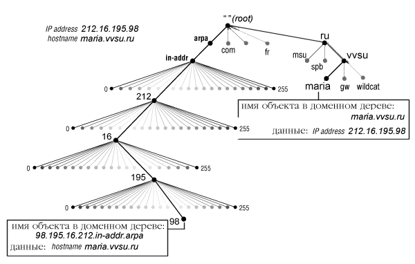

<script type="text/x-mathjax-config">MathJax.Hub.Config({tex2jax: {inlineMath: [['$','$'], ['\(','\)']]}});</script><script src='https://cdnjs.cloudflare.com/ajax/libs/mathjax/2.7.5/MathJax.js?config=TeX-MML-AM_CHTML' async></script>
[home](../../../) > [inet](../../) > [dns](../) > config

# Конфигурация DNS сервера

Конфигурация и база данных DNS сервера состоит из нескольких файлов (используется пакет BIND, являющийся де-факто стандартом DNS-сервера).

[TOC]

*Далее, на примере BIND v8*

## Файл конфигурации

Конфигурация DNS-сервера описывается в конфигурационном файле /etc/named.conf.

Конфигурационный файл содержит информацию о всех зонах, для которых DNS-сервер является первичным или вторичным. А именно:

* **Имя зоны**

* Если DNS-сервер первичный для этой зоны:

  * **Файл базы данных** DNS для этой зоны

  Если вторичный:

  * **Файл временного хранения** базы данных, полученной от первичного сервера

* **Файл ициализации кэша**

* **Каталог**, в который помещены все файлы

В число зон входят зоны (домены), в которых сервер осуществляет прямой поиск (имя в адрес), зоны реверсивного поиска (адрес в имя) и зона локальной петли (служит для преобразования 127.0.0.1 в localhost).

```pseudocode
options {
  directory "/usr/named";
};

zone "vvsu.ru" {
    type master;
    file "vvsu.hosts";
};

zone "vsue.ru" {
     type slave;
     masters {212.16.198.4;};
     file "vsue.hosts";
};

zone "195.16.212.IN-ADDR.ARPA" {
     type master;
     file "vvsu-195.rev";
};

zone "." {
     type hint;
     file "root.cache";
};

// однострочный комментарий
/* многострочный
      комментарий         */
# однострочный комментарий
```

## Файл инициализации кэша

Содержит IP-адреса корневых DNS-серверов, с которых начинает поиск сервер, если информация не содержится в кэше или в собственной базе данных. 

Для обновления файла нужно получить список всех корневых серверов. Получить такой список можно с помощью программы nslookup.

## Файл описания зоны

Содержит стандартные ресурсные записи базы данных DNS.

### Формат ресурсной записи

`NAME` `TTL` `CLASS` `TYPE` `DATA`

`;` - комментарий

`@` - имя текущего домена

`()` - запись в несколько строк

`*` - метасимвол (в поле имени)

**NAME** - доменное имя, к которому принадлежит данная запись. При отсутствии данного поля - берётся из предыдущей

Символ `@` вместо имени означает, что имя будет взято из строки конфигурационного файла.

**TTL** - время в секундах, в течение которого данная запись хранится в кэше.

*RFC 1035: Если пусто, то по равно TTL, определенного в записи SOA данной зоны*

**CLASS** - тип сети, в большинстве случаев: **IN** - Internet

**TYPE** - тип ресурсной записи

**DATA** - информация, формат и синтаксис которой определяется типом


###Типы ресурсных записей

#### SOA (Start Of Authority)

Первая запись в файле

**NAME** - полное доменное имя зоны, данные которой содержатся в файле.

**DATA**: `MNAME` `RNAME` (`SERIAL` `REFRESH` `RETRY` `EXPIRE` `MINIMUM`)

* **MNAME** - Доменное имя сервера

* **RNAME** - Адрес администратора зоны

* **SERIAL** - Серийный номер файла зоны

			При каждом внесении изменений необходимо увеличивать

	Обычно записывается в формате `YYYY` `MM` `DD` `nn`

* **REFRESH** - Период запроса на обновление данных со стороны вторичного сервера
* **RETRY** - Время ожидания после неудачной попытки запроса
* **EXPIRE** - Срок годности данных; время, через которое вторичный сервер прекратит обслуживать запросы, если не удастся восстановить свзяь с первичным сервером
* **MINIMUM** - Время жизни данных зоны в кэше запросившего их сервера

Пример:

```pseudocode
vvsu.ru. IN SOA maria.vvsu.ru. dns.maria.vvsu.ru.(
         1997120802 ;   Serial
         10800 ;        Refresh 3 hours
         3600  ;        Retry   1 hour
         3600000 ;      Expire 1000 hrs
         86400 );       Min 24 hours
```


#### NS (Name Server)

Указание сервера DNS

**NAME** - имя домена

**DATA** - доменное имя сервера, обсуживающего данный домент. Указываются как первичные, так и вторичные.

Пример:

```pseudocode
vvsu.ru.	IN	NS	maria.vvsu.ru.
        	IN	NS	ints.vtc.ru.
```


#### MX (Mail Exchanger)

Назначение обработчика почты

**NAME** - доменное имя

**DATA**: `PRIORITY ` `RECEIVER`

* **PRIORITY** - чем меньше число, тем больше приоритет
* **RECEIVER** - доменное имя хоста-получателя почты, адресованной с указанным доменным именем.

Пример:

```pseudocode
vvsu.ru.           	IN	MX	10	wildcat.vvsu.ru.
                   	IN	MX	20	maria.vvsu.ru.
specialmail.vvsu.ru	IN	MX	10	maria.vvsu.ru
```

При отсутствии записи MX для какого-либо доменного имени, почта будет доставляться непосредственно на хост, имеющий такое имя. 

Однако, такого хоста может не быть (например, хоста specialmail.vvsu.ru не существует, это просто псевдодомен, используемый в адресах электронной почты для удобства пользования и администрирования), в этом случае почта вернется отправителю с сообщением об ошибке. 


#### A (Address)

Определение IP-адреса v4

**NAME** - имя хоста. Если имя не является абсолютным (точка на конце), к нему присоединяется доменное имя зоны.

**DATA** - IP-адрес

Пример:

```pseudocode
gw         	IN	A	212.16.195.1
```

Эта запись, находящаяся в зоне *vvsu.ru*, эквивалентна следующей:

```pseudocode
gw.vvsu.ru.	IN	A	212.16.195.1
```


#### Glued Record

Допустим, у вас есть домен `yourdomain.com`, и DNS-серверы:
`ns1.yourdomain.com` `ns2.yourdomain.com` находятся в той же зоне.

Чтобы определить адрес `yourdomain.com`, нужно получить его у `ns1.yourdomain.com`, адрес которого нужно получить у него же самого. Бесконечный цикл.

Чтобы такого не произошло, администратор верхней по отношению к нам зоны должен прописать **приклеенную А-запись** для нашего DNS-сервера.

Пример:

```pseudocode
ns1	IN	A	182.18.164.124
```


#### AAAA (Address IPv6)

Определение IPv6

Пример:

```pseudocode
ns1	IN	AAAA	2400:3b00:1:1::2
```


#### CNAME (Canonical Name)

Определение псевдонимов

**NAME** - псевдоним (alias) хоста, доменное имя (может быть, не полностью уточненное)

**DATA** - каноничное (настоящее) доменное имя хоста (во всех записях выше используется только каноничное имя)

Пример:

```pseudocode
www        	IN	CNAME	wildcat.vvsu.ru.
```

Эта запись, находящаяся в зоне *vvsu.ru*, означает, что *www.vvsu.ru* = *wildcat.vvsu.ru.* При переносе WWW-сервера на другой компьютер, достаточно будет изменить только эту строку в файле зоны, чтобы ссылки на него заработали


#### SPF (Sender Policy Framework)

Указывает сервера, которые могут отправлять почту от имени домена

Пример:

```pseudocode
site.ru	IN	TXT	v=spf1 include:_spf.hosting.reg.ru ip4:37.140.192.92 a mx ~all
```

**v=spf1** - определяет версию SPF

**include:_spf.hosting.reg.ru** - включает в запись SPF значение SPF записи другого домена

**ip4:37.140.192.92** - разрешает прием почты с IP-адреса

**a** - разрешает прием почты с сервера, IP-адрес которого стоит в А-записи домена

**mx** - разрешает прием почты, если отправляющий сервер указан в одной из MX-записей домена

**~all** - если письмо пришло с сервера, который не входит в вышеперечисленный список, его стоит проанализирвоать более тщательно. При **-all** такое письмо сразу отбрасывается.


## Файл обратной зоны

Предназначен для проведения обратного преобразования, "IP-адрес в имя". 

Технология этого преобразования сильно не отличается от обычного DNS-преобразования. Используется специальный домен *in-addr.arpa*., слева от которого в обратном порядке записывается IP-адрес. 



Поиск производится по обычному алгоритму:

1. Запрашивается корневой сервер

   Если у него нет готового ответа, возвращает адрес ответственного за in-addr.arpa.

2. Далее сервер in-addr.arpa (при отсутствии ответа), возвращает адрес ответственного за 212.in-addr.arpa

   ...

* Искомые данные находятся на DNS-сервере, отвественным за 195.16.212.in-addr.arpa и хранятся в конфигурационном файле. Такие данные имеют тип **PTR**.


#### PTR (Pointer)

**NAME** - последний (младший) байт IP-адреса

**DATA** - полностью уточненное доменное имя хоста с таким адресом

Использование записи PTR позволяет бороться со спамом:

​	При получении письма, отправляется PTR-запрос отправителя. 

​	Если сервер отправителя не совпадает с адресом отправителя, указанном внутри письма - письмо попадает в спам. 

Пример:

```pseudocode
98	IN	PTR	maria.vvsu.ru.
```


## Файл локальной петли

Файл *local.rev* и зона локальной петли (loopback) предназначены для преобразования адреса 127.0.0.1 в имя localhost.

Структура файла ничего не отличается от других.

`Имя зоны: 0.0.127.IN-ADDR.ARPA.`

```pseudocode
@	IN	SOA	maria.vvsu.ru.	fire.maria.vvsu.ru. (
	1997120802; Serial
	36000 ;     Refresh
	10800 ;     Retry
	3600000 ;   Expire
	86400 ) ;   Minimum
	IN	NS	maria.vvsu.ru.
	IN	NS	ns.rosprint.net.
1	IN	PTR	localhost.
```
