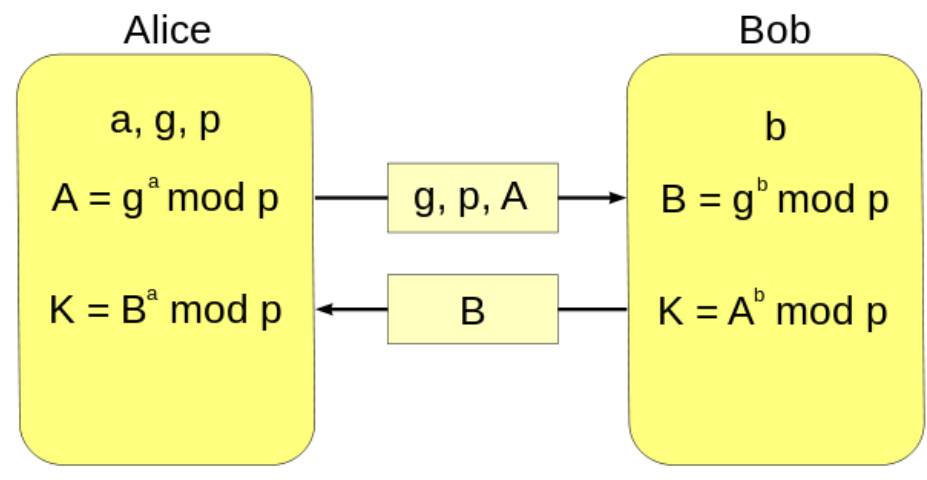
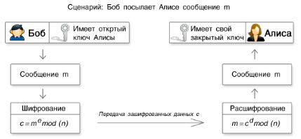
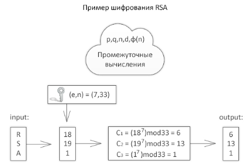

## Цифровая подпись

​	В основе криптографических систем с открытым ключом лежат **односторонние функции** – такие функции обладают следующими свойствами:

1. По известному $x$ достаточно просто вычислить $f(x)$.
2. По известному $f(x)$ достаточно сложно вычислить $x$.

## Отличие от симметричных криптосистем

### Минусы

1. Скорость работы алгоритмов с открытым ключом намного ниже. Поэтому такие шифры используются для шифрования небольших по размеру данных, например, ключей. 
2. Длина ключей значительно больше, чем в симметричных криптосистемах. 

### Плюсы

1. Удобное распределение открытых ключей, не требует секретности. 
2. В больших сетях число ключей значительно меньше, чем в симметричной криптосистеме.

## Криптосистемы с открытым ключом

### Протокол Диффи - Хеллмана

__Алгоритм Ди́ффи — Хе́ллмана__ — криптографический протокол, позволяющий двум и более сторонам получить общий секретный ключ, используя незащищенный от прослушивания канал связи. Полученный ключ используется для шифрования дальнейшего обмена с помощью алгоритмов симметричного шифрования. 

#### Алгоритм

1. Алиса и Боб выбрали общий генератор (**g**) и модуль (**p** - простое число).
2. Алиса и Боб выбрали по одному скрытому ключу (**a** и **b** соответственно).
3. Алиса и Боб вычислили **A = $g^a mod(p)$** и **B = $g^b mod(p)$** соответственно.
4. Алиса и Боб обменялись полученными результатами.
5. Алиса вычислила **K = $B^a mod(p)$**
6. Боб вычислил **K = $A^b mod(p)$**
7. Теперь у Алисы и Боба есть общий ключ (**K**).

* Этот математический трюк обосновывается свойствами остатков

$$
K = A^b mod p = (g^a mod(p))^bmodp ≡ g^{ab} mod(p) ≡ B^amodp
$$

#### Пример

| Alice                 | Bob                      |
| --------------------- | ------------------------ |
| p = 23                | g = 5                    |
| a = 6                 | b = 15                   |
| A = $5^6 mod 23 = 8$  | B = $5^{15} mod 23$ = 19 |
| K = $19^6 mod 23$ = 2 | K = $8^{15} mod 23$ = 2  |

### Алгоритм RSA

*Rivest, Shamir, Adleman*

__RSA__ — криптографический алгоритм с открытым ключом, основывающийся на вычислительной сложности задачи факторизации больших целых чисел. Для шифрования используется простая операция возведения в степень по модулю N. Для расшифрования же необходимо вычислить функцию Эйлера от числа N, для этого необходимо знать разложение числа n на простые множители (В этом и состоит задача факторизации). 

В RSA открытый и закрытый ключ состоит из пары целых чисел. Закрытый ключ хранится в секрете, а открытый ключ сообщается другому участнику, либо где-то публикуется. 

#### Алгоритм

1. Выбираются два различных случайных простых числа p, q. 
2. Вычисляется модуль n = $pq$
3. Вычисляется значение функции Эйлера $Ф(n) = (p-1)(q-1) $
4. Выбирается целое число e: $1<e<Ф(n)$, взаимно простое со значением функции $Ф(n)$. Число e называется открытой экспонентой.
5. Выбирается целое число d: $(de) mod Ф(n) = 1$ Число называется секретной экспонентой. 
6. Пара {e, n} – открытый ключ RSA 
7. Пара {d, n} – закрытый ключ RSA 

#### Шифрование и расшифровывание

Алиса заранее сгенерировала закрытый и открытый ключ, а затем отправила открытый ключ Бобу. Боб хочет послать зашифрованное сообщение Алисе: 

__Шифрование__: Боб шифрует сообщение m, используя открытый ключ Алисы __(e, N)__:
$$
C=E(M)=M^emod(N)
$$
__Расшифровывание__: Алиса принимает зашифрованное сообщение __c__. Используя закрытый ключ __(d, N)__, расшифровывает сообщение:
$$
M=D(C)=C^dmodN
$$

#### Пример

1. Зашифруем и расшифруем сообщение "RSA" по алгоритму RSA. Для простоты возьмем небольшие числа: p=3 и q=11. 

2. Определим n= 3*11 = 33.

   $Ф(n) = (p-1)(q-1)=20$. 

3. Пусть e = 7: открытая экспонента.

4. Находим d: $(7*d) mod 20 = 1$.

   d = 3, т. к. по теореме Эйлера $d = e ^{(Ф(n)-1)} mod n$. 

5. Представим шифруемое сообщение как последовательность чисел в диапазоне от 0 до 32. Буква А =1, В=2, С=3 и т.д. 

   $R = 18; S = 19; A = 1;$

6. Теперь зашифруем сообщение, используя открытый ключ {7,33} 

   $C1 = (18^7) mod 33 = 6;$

   $C2 = (19^7) mod 33 = 13;$

   $C3 = (1^7) mod 33 = 1;$

7. Теперь расшифруем данные, используя закрытый ключ {3,33}. 

   $M1=(6^3) mod 33 =18(R); $

   $M2=(13^3) mod 33 =19(S); $

   $M3=(1^3) mod 33 = 1(A); $