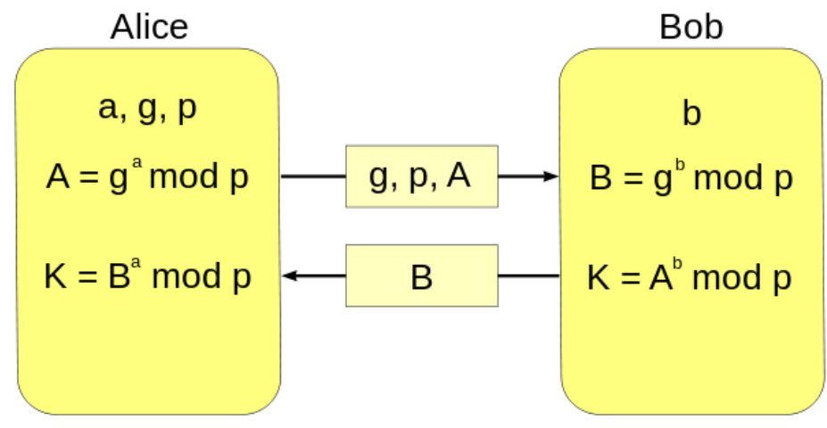

# Криптосистемы с открытым ключом

[TOC]

## Цифровая подпись

​	В основе криптографических систем с открытым ключом лежат **односторонние функции** – такие функции, которые обладают следующими свойствами:

1. Пусть известно значение xx, тогда вычислить F(x)F(x)относительно просто.
2. Пусть известно y=F(x), однако вычислить x сложно.

​	 __Необходимо понимать, что криптосистемы с открытым ключом не заменяют симметричные криптосистемы, это связано с тем, что:__

1. Скорость работы алгоритмов с открытым ключом намного ниже, чем скорость работы симметричных алгоритмов. Поэтому ассиметричные шифры используются для шифрования небольших по размеру данных, например, ключей. 
2. Длина ключей значительно больше, чем в симметричных криптосистемах. 

​	 __Конечно, есть и плюсы, например:__

1. Удобное распределение открытых ключей, не требует секретности. 
2. В больших сетях число ключей значительно меньше, чем в симметричной криптосистеме. 

## Криптосистемы с открытым ключом

### Diffie-Hellman

__Алгоритм Ди́ффи — Хе́ллмана__ ( Diffie-Hellman, *DH*) — криптографический протокол, позволяющий двум и более сторонам получить общий секретный ключ, используя незащищенный от прослушивания канал связи. Полученный ключ используется для шифрования дальнейшего обмена с помощью алгоритмов симметричного шифрования. 

#### Алгоритм

1. Алиса и Боб выбрали общий генератор(g) и модуль(p - простое число).
2. Алиса и Боб выбрали по одному скрытому ключу(a и b соответственно).
3. Алиса и Боб посчитали остаток от генератора, возводенного в соответствующие скрытые ключи(A и B  соответственно).
4. Алиса и Боб обменялись полученными результатами.
5. Алиса посчитала остаток от присланного результата, возведенного в степень скрытого ключа(K).
6. Боб посчитал остаток от присланного результата, возведенного в степень скрытого ключа(K).
7. Теперь у Алисы и Боба есть общий ключ(K).

* Этот математический трюк обосновывается малой теоремой Ферма.

$$
K = a^b mod p = (g^ab)modp=B^amodp
$$

#### Пример

| Alice                        | Bob                           |
| ---------------------------- | ----------------------------- |
| p = 23, g = 5                | p = 23, g = 5                 |
| a = 6                        | b = 15                        |
| A = 5^6 mod 23 = 8           | B = 5^15 mod 23 = 19          |
| K = 19^6 mod 23 = 2          | K = 8^15 mod 23 = 2           |
| K = 19^6 mod 23 = 8^b mod 23 | K = 8^15 mod 23 = 19^a mod 23 |

### RSA

(Rivest, Shamir, Adleman)

__RSA__ — криптографический алгоритм с открытым ключом, основывающийся на вычислительной сложности задачи факторизации больших целых чисел. Для шифрования используется простая операция возведения в степень по модулю N. Для расшифрования же необходимо вычислить функцию Эйлера от числа N, для этого необходимо знать разложение числа n на простые множители (В этом и состоит задача факторизации). 

​	В RSA открытый и закрытый ключ состоит из пары целых чисел. Закрытый ключ хранится в секрете, а открытый ключ сообщается другому участнику, либо где-то публикуется. 

#### Алгоритм

1. Выбираются два различных случайных простых числа p, q. 
2. Вычисляется модуль n = p * q 
3. Вычисляется значение функции Эйлера Ф(n) = (p-1) * (q-1) 
4. Выбирается целое число e: 1<e<Ф(n), взаимно простое со значением функции Ф(n). Число e называется открытой экспонентой.
5. Выбирается целое число d. d * e mod Ф(n) = 1 Число называется секретной экспонентой. 
6. Пара {e, n} – открытый ключ RSA 
7. Пара {d, n} – закрытый ключ RSA 

#### Шифрование и расшифровывание в RSA

​	Есть следующий сценарий: Боб и Алиса переписываются в интернете, но хотят использовать шифрование, чтобы поддерживать переписку в секрете :). Алиса заранее сгенерировала закрытый и открытый ключ, а затем отправила открытый ключ Бобу. Боб хочет послать зашифрованное сообщение Алисе: 

__Шифрование__: Боб шифрует сообщение m, используя открытый ключ Алисы __(e, N)__:
$$
C=E(M)=M^emod(N)
$$
__Расшифровывание__: Алиса принимает зашифрованное сообщение __c__. Используя закрытый ключ __(d, N)__, расшифровывает сообщение:
$$
M=D(C)=C^dmodN
$$

#### Пример

> Зашифруем и расшифруем сообщение "RSA" по алгоритму RSA. Для простоты возьмем небольшие числа: p=3 и q=11. 

> Определим n= 3*11 = 33.
>
> *Ф(n) = (p-1)*(q-1)=20. 

> Пусть e будет равно 7: (e=7) - открытая экспонента.

> Находим d: (d*7) mod 20 = 1. Ясно, что d = 3, т. к. по теореме Эйлера d = e ^(Ф(n)-1) mod n. 

> Представим шифруемое сообщение как последовательность чисел в диапазоне от 0 до 32. Буква А =1, В=2, С=3 и т.д. 
>
> R = 18;
>
> S = 19;
>
> A  1;

> Теперь зашифруем сообщение, используя открытый ключ {7,33} 

> C1 = (18^7) mod 33 = 2187 mod 33 = 6;

> C2 = (19^7) mod 33 = 13;

> C3 = (1^7) mod 33 = 1;

> Теперь расшифруем данные, используя закрытый ключ {3,33}. 

> M1=(6^3) mod 33 =18(R); 

> M2=(13^3) mod 33 =19(S); 

> M3=(1^3) mod 33 = 1(A); 
