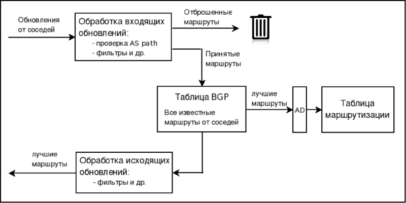

**Border Gateway Protocol** - основной протокол динамической маршрутизации маршрутизации в Интернете.

Предназначен для обмена информацией о доступностей подсетей между AS.

- Поддержка бесклассовой междоменной маршрутизации.
- Использует суммирование маршрутов для уменьшения таблиц маршрутизации.

Также передаются различные атрибуты этих сетей, с помощью которых BGP выбирает лучший маршрут и настраиваются политики маршрутизации.

Один из основных атрибутов — это список AS, через которые прошла эта информация. Эта информация позволяет BGP определять где находится сеть относительно AS, исключать петли маршрутизации, а также может быть использована при настройке политик. 

* Поддерживает только парадигму пересылки на основе адреса получателя.
* Использует протокол TCP/179.
* Отправляет обновления только после изменения в сети
* Периодически отправляет **KEEPALIVE**-сообщения для проверки TCP-соединения

[TOC]

## Принцип работы

### Таблицы маршрутизации

* **Таблица соседей** - список соседних маршрутизаторов
* **Таблица BGP**:
  * Список сетей, полученных от каждого соседа
  * Может содержать несколько путей к destination сетям
  * Атрибуты BGP для каждого пути
* **Таблица маршрутизации** - список лучших путей к сетям

BGP делится на:

- **iBGP** - передача информации внутри АS
- **eBGP** - между AS

Если iBGP-маршрутизаторы работают в нетранзитной AS, то соединение между ними должно быть **full mesh** (каждый-с-каждым). Это следствие принципов работы протокола — если маршрутизатор, находящийся на границе AS, получил обновление, то он передает его всем соседям; соседи, которые находятся внутри AS, больше это обновление не распространяют, так как считают, что все соседи внутри AS уже его получили. 

### Таймеры протокола

**Keepalive Interval** - интервал между отправкой **KEEPALIVE** (60 секунд)

**Hold Time** - таймер, по истечению которого сосед будет считаться недоступным (180 секунд)

## Типы сообщений

### Заголовок BGP

`------Marker-(16-байт)------` `Length(2байт)` `Type(1)`

__Marker__ - содержит 1 в каждом бите, для совместимости с предыдущими версиями BGP.

__Length__ - размер сообщения (включая заголовок) в байтах. 19 ≤ Length ≤ 4096.

__Type__ - содержит код типа сообщения:

1. __OPEN__
2. __UPDATE__
3. __NOTIFICATION__
4. __KEEPALIVE__

### Сообщение OPEN

Используется для установки отношений соседства и обмена базовыми параметрами. Отправляется сразу после установки TCP-соединения.

`Version(1)` `MyAutonomousSystem(2)` `---Hold-Time-(2)---` `---------BGP-Identifier-(4-байт)--------- ` `OptPLen(1)` `Optional-Parameters-(?)`

**Version** - номер версии протокла

**My Autonomous System** - номер AS отправителя

**Hold Time** - макс. время в секундах, которое может пройти между получением **KEEPALIVE** и **UPDATE**

**Optional Parameters Length** - длина дополнительных параметров в байтах. 

* Если 0, то в **Marker** записываются единицы
* Если не 0, то в **Optional Parameters** записываются данные для определения кода в **Marker**

### Сообщение UPDATE

Используется для обмена информацией маршрутизации

`-----Withdrawn-Routes-Length-(2-байта)----`

`-----------Withdrawn-Routes-(?)-----------`

`---Total-Path-Attribute-Length-(2-байта)--`

`------------Path-Attributes-(?)-----------`

`Network-Layer-Reachability-Information-(?)`

__Withdrawn Routes__ - список префиксов IP-адресов для отзываемых маршрутов.

Префикс = Длина, Префикс

| 22       | 202.100.44                     |
| -------- | ------------------------------ |
| 00010110 | 11001010.01100100.001011__00__ |

__Path Attributes__ - последовательность переменной длины с атрибутами пути.

__Network Layer Reachability Information__ - последовательность переменной длины с адресными префиксами IP.

Префикс = Длина, Префикс

__!__ Сообщение  UPDATE может анонсировать не более одного набора атрибутов пути, но этому пути может соответствовать множество адресатов, путь к которым описывается общим набором атрибутов.

### Сообщение NOTIFICATION

Используется, когда возникают ошибки BGP. После отправки сообщения, сессия с соседом разрывается.

`Error-Code-(1)` `ErrorSubcode(1)` `----Data-(6-байт)----`

**Error Code** - тип оповещения:

1. Message Header Error
2. OPEN Message Error
3. UPDATE Message Error
4. Hold Timer Expired
5. Finite State Machine Error
6. Cease

### Сообщение KEEPALIVE

Используется для поддерживания отношений соседства, для обнаружения неактивных соседей.

Сообщения Keepalive состоят только из заголовка пакета.

Если периодичность отправки keepalive-сообщений равна 0, то сообщения не отправляются.

## Отношение соседства

Отношения соседства устанавливаются вручную для каждого соседа. При этом обязательно указывается автономная система соседа. По этой информации BGP определяет тип соседа:

- **Внутренний BGP сосед (iBGP-сосед)** — сосед, который находится в той же AS. iBGP-соседи не обязательно должны быть непосредственно соединены.
- **Внешний BGP сосед (eBGP-сосед)** — сосед, который находится в друго AS. По умолчанию, eBGP-соседи должны быть непосредственно соединены.

BGP выполняет такие проверки, когда формирует отношения соседства:

1. Маршрутизатор должен получить запрос на TCP-соединение с адресом отправителя, указанным в списке соседей (команда **neighbor**).
2. Номер AS локального маршрутизатора должен совпадать с номером AS, который указан на соседнем маршрутизаторе командой **neighbor remote-as** (это требование не соблюдается при настройках конфедераций).
3. Идентификаторы маршрутизаторов (Router ID) не должны совпадать.
4. Если настроена аутентификация, то соседи должны пройти её.

У первого пункта проверки есть некоторая особенность: только у одного из двух маршрутизаторов IP-адрес, указанный как адрес отправки обновлений, должен быть указан в команде **neighbor** другого маршрутизатора.

### Состояния связи с соседями

* **IDLE** - ничего не происходит
* **CONNECT** - слушает и посылает пакеты TCP
* **ACTIVE** - ждет ответа
* **OPEN SENT** - сообщение OPEN отправлено
* **OPEN CONFIRM** - сообщение OPEN получено
* **ESTABLISHED** - стабильное состояние соседства

## Выбор маршрута

Характеристики процедуры выбора пути протоколом BGP:

- В таблице BGP хранятся все известные пути, а в таблице маршрутизации — лучшие.
- Пути выбираются на основании политик.
- Пути не выбираются на основании пропускной способности.

### Cisco

На маршрутизаторе Cisco, если не настроены никакие политики выбора пути, выбор пути происходит таким образом (на каждый следующий шаг маршрутизатор переходит только при совпадении значений на предыдущем):

1. Максимальное значение **weight** (локально для маршрутизатора).
2. Максимальное значение **local preference** (для всей AS).
3. Предпочесть **локальный маршрут** маршрутизатора (next hop = 0.0.0.0).
4. Кратчайший путь через автономные системы. (самый короткий **AS_PATH**)
5. Минимальное значение **origin code** (IGP < EGP < incomplete).
6. Минимальное значение **MED** (распространяется между автономными системами).
7. Путь **eBGP** лучше чем путь iBGP.
8. Выбрать путь через **ближайшего IGP-соседа**.
9. Выбрать самый **старый маршрут** для eBGP-пути.
10. Выбрать путь через соседа с **наименьшим BGP router ID.**
11. Выбрать путь через соседа с **наименьшим IP-адресом**.

### Juniper

Если существует несколько маршрутов до одной сети назначения, будет выбран только один из них. Каждый шаг в алгоритме выбора лучшего маршрута пытается устранить все, кроме одного маршруты к пункту назначения. Если на шаге алгоритма маршрутов все еще больше одного, будет выполнен переход на следующий шаг алгоритма:

1. проверка на доступность **next-hop** в локальной таблице маршрутизации. Если next-hop не доступен, маршрут отбрасывается.
2. маршрутизатор выбирает маршрут с наибольшим **Local Preference** атрибутом.
3. маршрутизатор выбирает маршрут с кратчайшим **AS Path length**.
4. маршрутизатор выбирает маршрут с наименьшим значением атрибута **Origin** (то есть отдается предпочтение IGP).
5. маршрутизатор выбирает маршрут с наименьшим значением **MED**. Этот шаг выполняется, по умолчанию, только для маршрутов из одной AS.
6. маршрутизатор выбирает маршруты, полученные от соседей **EBGP** нежели полученные от IBGP соседей. Если остальные маршруты EBGP-маршруты, маршрутизатор переходит к шагу 9.
7. маршрутизатор выбирает маршрут с наименьшей метрикой **IGP** к анонсируемому BGP Next Hop.
8. если используется Route Reflection для IBGP пиринга, маршрутизатор выбирает путь с наименьшим **Cluster-List length**.
9. маршрутизатор выбирает маршрут от партнера с наименьшим **Router ID**.
10. маршрутизатор выбирает маршрут от партнера с наименьшим **Peer Address**.

## Конфедерации

**Конфедерации** - это механизм, который позволяет обойти необходимость полной связности внутренних соседей BGP. При использовании конфедераций, исходная AS разбивается на подавтономные системы (sub-AS), внутри которых соседи должны быть соединены друг с другом в полносвязной топологии. 

Создание конфедерации позволяет:

- избежать необходимости создания полносвязной топологии между всеми iBGP-соседями,
- всем iBGP-соседям выучить все iBGP-маршруты в AS,
- предотвратить образование петель.

### Принцип работы

Маршрутизаторы, которые находятся в одной sub-AS называются confederation iBGP-соседи, а маршрутизаторы в разных sub-AS называются confederation eBGP-соседи. 

Правила работы маршрутизаторов в конфедерации:

- iBGP-соседи в конфедерации должны быть соединены в полносвязную топологию. Они, как и обычные iBGP-соседи, не передают iBGP-маршруты друг другу.

- eBGP-соседи в конфедерации:
  - как и eBGP-соседи анонсируют iBGP-маршруты, выученные внутри sub-AS конфедерации, в другую sub-AS

  - как и eBGP-соседи по умолчанию используют для пакетов TTL 1

  - во всех остальных случаях работают как обычные iBGP-соседи 

    (например, next-hop по умолчанию не изменяется).

- Внутри конфедераций для предотвращения петель используется атрибут AS Path. Маршрутизаторы, которые находятся в конфедерации добавляют в атрибут сегменты AS_CONFED_SEQ и AS_CONFED_SET.
- Когда маршрутизатор выбирает лучший маршрут на основании атрибута AS Path, номера автономных систем конфедераций не учитываются.
- Когда обновление отправляется маршрутизатору, который не находится в конфедерации, то номера конфедераций удаляются.